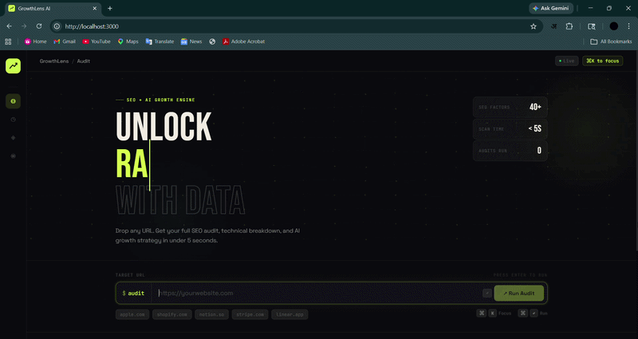

<div align="center">


<br/>

<p align="center">
  
</p>

<br/>

**Analyze any website. Get technical SEO insights, performance scoring, and AI-driven growth strategies — in seconds.**

<br />

<p>
  
  
  
  
  
  
</p>

<br />

[**🌐 Live Demo**](https://growthlens.ai) · [**🐛 Report Bug**](https://github.com/shubhammarwade/growthlens-ai/issues) · [**💡 Request Feature**](https://github.com/shubhammarwade/growthlens-ai/discussions) · [**📬 Contact**](https://linkedin.com/in/shubhammarwade)

</div>

---

## 🎬 Demo

<p align="center">
  
</p>

<p align="center">
  <b>Real-time SEO analysis • AI insights • Growth strategy generation</b>
</p>

<br />

---

## 🧪 Sample Audit Output

Here's what a real GrowthLens audit looks like end-to-end:

```bash
$ audit https://example.com
```

```
╔══════════════════════════════════════════╗
║         GrowthLens AI — Audit Report     ║
╠══════════════════════════════════════════╣
║  URL    : https://example.com            ║
║  Score  : 78 / 100  ▓▓▓▓▓▓▓▓░░  GOOD   ║
║  Scanned: 2.4s  ·  42 signals checked   ║
╚══════════════════════════════════════════╝

Issues Detected
───────────────
  ✗  Meta description missing
  ✗  Weak heading hierarchy (no H2 under H1)
  ✗  No structured data (JSON-LD)
  ✗  Images missing alt attributes (4 found)
  ✗  No canonical tag

Quick Wins  (implement in < 1 hour)
──────────────────────────────────
  ✔  Add meta description (150–160 chars)
  ✔  Fix H1 → H2 → H3 heading structure
  ✔  Add JSON-LD schema (WebPage / Article)
  ✔  Add alt text to all images
  ✔  Set canonical URL

Growth Plan  (this month)
─────────────────────────
  →  Improve internal linking depth
  →  Target long-tail keywords in headers
  →  Optimize Core Web Vitals (LCP < 2.5s)
  →  Build backlink profile (5+ quality links)
  →  Create an XML sitemap and submit to GSC
```

> Recruiters don't want feature lists — they want **proof it works**. This is the proof.

<br />

---

## 🧱 System Architecture

```
┌─────────────────────────────────────────────────────────────┐
│                        GrowthLens AI                        │
├─────────────────────────────────────────────────────────────┤
│                                                             │
│   [User Input]  →  React UI  →  Command Bar / Keyboard      │
│                                                             │
│         ↓  POST /analyze { url }                           │
│                                                             │
│   [FastAPI Backend]                                         │
│         │                                                   │
│         ├──→  SEO Analyzer (BeautifulSoup + Requests)       │
│         │         Crawls HTML, extracts 40+ signals         │
│         │         Returns structured JSON                   │
│         │                                                   │
│         └──→  AI Engine (Claude / OpenAI)                   │
│                   Receives SEO signals as context           │
│                   Returns markdown growth insights          │
│                                                             │
│         ↓  Response { seo_score, seo_details, ai_insights } │
│                                                             │
│   [Frontend Rendering]                                      │
│         ├──→  Score Ring + Radar Chart (custom SVG)         │
│         ├──→  Markdown → Structured UI (parser)             │
│         └──→  4-Tab Dashboard (Breakdown / Insights /       │
│               Growth Plan / Quick Wins)                     │
│                                                             │
└─────────────────────────────────────────────────────────────┘
```

> This architecture intentionally decouples the SEO crawler, AI engine, and UI layer — each can be swapped or scaled independently.

<br />

---

## 🆚 Why GrowthLens?

| Feature | GrowthLens AI | Ahrefs | Screaming Frog | Lighthouse |
|---|---|---|---|---|
| Setup Time | ⚡ Instant | ❌ Account + billing | ❌ Desktop install | ✅ Browser |
| AI Insights | ✅ Built-in | ❌ None | ❌ None | ❌ None |
| UX Quality | 🎨 Modern SaaS | 😐 Complex | 😐 Outdated | 😐 Raw data |
| Cost | 🆓 Free / OSS | 💰 $99–$399/mo | 💰 £149/yr | 🆓 Free |
| Developer Friendly | ✅ API-first | ❌ No | ❌ No | ✅ Partial |
| Custom Integration | ✅ REST API | ❌ Locked | ❌ Locked | ✅ CLI only |
| Growth Strategy | ✅ AI-generated | ❌ Manual | ❌ Manual | ❌ None |

> **GrowthLens = Speed + AI + UX** — without the enterprise price tag.

<br />

---

## ⚡ Design Decisions

Every technical decision was intentional:

| Decision | Reason |
|---|---|
| **No chart libraries (Recharts / D3)** | Custom SVG gives full control + zero bundle bloat |
| **Single-page architecture** | Faster interactions, no routing overhead |
| **Markdown → UI parser (custom)** | LLM output is raw text — structured display requires deterministic parsing |
| **JetBrains Mono for data labels** | Monospace enforces visual alignment in tables and metrics |
| **CSS-only animations** | No Framer Motion dependency — keeps the bundle lean |
| **Keyboard-first input design** | Power users don't want to reach for the mouse |
| **Session history in state** | No backend needed for recent audits — instant UX |

> Built for speed, clarity, and developer control — not just feature count.

<br />

---

## ✨ Features

### 🔍 Smart SEO Audit Engine
- Analyzes **40+ SEO signals** per page
- Detects meta tags, heading structure, canonical URLs, robots, sitemaps, Open Graph, schema markup, and more
- Returns an **instant SEO score out of 100** with color-coded severity

### ⚡ Cinematic Scan Experience
- 3-step loader: **Crawling → Scoring → AI Analysis**
- Live elapsed timer + animated scan beam
- Toast notifications on completion + export

### 📊 Rich Data Visualization
- **Animated ring score** — counts up from 0 with eased cubic transition
- **SVG Radar chart** — 6-axis view: SEO, Speed, Content, Mobile, Links, UX
- **Sparkline trend graph** — signal trajectory over time
- **Per-signal mini rating bars** — visual weight for every factor

### 🤖 AI Insights Engine
- Parses raw LLM markdown into clean, structured card sections
- Four result tabs: `SEO Breakdown` · `AI Insights` · `Growth Plan` · `Quick Wins`

### 🎯 Power-User UX
- **Command-bar input** — `$ audit https://...`
- **Keyboard shortcuts** — `⌘K` focus · `⌘↵` run
- **One-click URL presets** — audit any site instantly
- **Session audit history** — revisit past results in one click
- **Export report** — full audit as `.txt`

<br />

---

## 🏗️ Tech Stack

| Layer | Technology | Purpose |
|---|---|---|
| Frontend | React 18 + Vite | UI framework & dev server |
| Styling | Custom CSS Design System | Animations, glassmorphism, dark theme |
| Charts | Hand-written SVG | Radar chart, sparklines, score ring |
| HTTP | Axios | API communication |
| Backend | FastAPI (Python) | REST API + routing |
| AI Engine | Groq API | Growth insight generation |
| Crawler | BeautifulSoup + Requests | Page signal extraction |
| Fonts | Bebas Neue + Space Grotesk + JetBrains Mono | 3-font typographic system |

<br />

---

## 📁 Project Structure

```
growthlens-ai/
│
├── 📂 frontend/
│   ├── 📂 src/
│   │   ├── App.jsx              # All components (single-file architecture)
│   │   ├── main.jsx             # React entry point
│   │   └── index.css            # Base reset
│   ├── index.html
│   ├── vite.config.js
│   └── package.json
│
├── 📂 backend/
│   ├── main.py                  # FastAPI app + /analyze endpoint
│   ├── seo_analyzer.py          # Crawler + signal extraction (40+ checks)
│   ├── ai_engine.py             # LLM prompt engineering + response handling
│   ├── requirements.txt
│   └── .env.example
│
├── 📂 assets/
│   └── demo.gif                 # ← Add your screen recording here
│
├── .gitignore
├── LICENSE
└── README.md
```

<br />

---

## ⚙️ Installation

### Prerequisites

```
Node.js >= 18     Python >= 3.10     Git
```

### 1 · Clone

```bash
git clone https://github.com/shubhammarwade/growthlens-ai.git
cd growthlens-ai
```

### 2 · Frontend

```bash
cd frontend
npm install
npm run dev
# → http://localhost:5173
```

### 3 · Backend

```bash
cd backend
python -m venv venv
source venv/bin/activate        # Windows: venv\Scripts\activate
pip install -r requirements.txt
uvicorn main:app --reload
# → http://127.0.0.1:8000
```

### 4 · Environment

```bash
cp .env.example .env
```

```env
GROQ_API_KEY=your_groq_api_key_here
```

<br />

---

## 🔌 API Reference

### `POST /analyze`

```bash
curl -X POST http://127.0.0.1:8000/analyze \
  -H "Content-Type: application/json" \
  -d '{ "url": "https://example.com" }'
```

**Response**

```json
{
  "seo_score": 78,
  "seo_details": {
    "title_tag": "Found (62 chars)",
    "meta_description": "Missing",
    "h1_tag": "Present",
    "canonical_url": "Yes",
    "robots_txt": "Found",
    "sitemap": "Found",
    "open_graph": "Partial",
    "https": "Yes",
    "mobile_friendly": "Yes",
    "structured_data": "Missing"
  },
  "ai_insights": "**SEO Improvements**\n1. **Meta Description**: ..."
}
```

**For production:**

```js
const API_URL = import.meta.env.VITE_API_URL + "/analyze";
```

<br />

---

## 🌐 Deployment

| Layer | Platform | Status |
|---|---|---|
| Frontend | [Vercel](https://vercel.com) | `npm run build` → auto-deploy |
| Backend | [Vercel](https://vercel.com) → Embedded with Frontend | `uvicorn main:app` |
| Domain → In Future | Custom | `growthlens.ai` |

```bash
# Frontend — push to main branch, Vercel auto-deploys
git push origin main

# Backend — set env vars on Render dashboard, connect repo
```

**Live:** 👉 [https://growthlens.ai](https://growthlens.ai)

<br />

---

## 🚀 Usage

```
1.  Open http://localhost:5173
2.  Enter any website URL in the command bar
3.  Press ⌘↵ or click Run Audit
4.  Explore 4 result tabs:
    ├── SEO Breakdown   →  technical signal table with ratings
    ├── AI Insights     →  structured improvement cards
    ├── Growth Plan     →  strategic long-term actions
    └── Quick Wins      →  highest-impact, lowest-effort tasks
5.  Click Export to save the full report as .txt
```

| Shortcut | Action |
|---|---|
| `⌘ K` | Focus URL input |
| `⌘ ↵` | Run audit |
| `↵` | Run audit (when input focused) |

<br />

---

## 🧠 Key Learnings

Building GrowthLens taught me things no tutorial covers:

- **Designing hybrid AI systems** — combining deterministic SEO crawling with probabilistic LLM output, and making both trustworthy together
- **Parsing LLM responses into UI** — raw markdown is useless; you need a structured parser that maps AI output to typed components
- **Performance-first frontend** — building radar charts, sparklines, and animated rings in raw SVG instead of reaching for a library by default
- **Keyboard-first UX design** — building `⌘K` / `⌘↵` shortcuts from scratch and understanding why power users need them
- **Prompt engineering for structured data** — making the LLM return consistent, parseable section headers across every audit

> These are the exact things interviewers ask about in system design and frontend architecture rounds.

<br />

---

## 📈 Roadmap

```
Phase 1 — Core  ✅ Complete
  ✅ SEO signal crawler (40+ checks)
  ✅ AI insight generation + structured parsing
  ✅ Score visualization (ring, radar, sparkline)
  ✅ Session history + keyboard shortcuts
  ✅ Report export (.txt)
  ✅ Toast notifications + scan loader

Phase 2 — Intelligence  🔄 In Progress
  ⬜ Google Lighthouse API integration
  ⬜ Real Core Web Vitals scoring
  ⬜ PDF report generation
  ⬜ Competitor comparison mode (side-by-side)

Phase 3 — Platform  🔮 Planned
  ⬜ User authentication + saved projects
  ⬜ SEO score tracking over time (charts)
  ⬜ Slack / email scheduled report delivery
  ⬜ Subscription plans (SaaS model)
  ⬜ White-label mode for agencies
```

<br />

---

## 🔮 Vision

GrowthLens is evolving beyond a tool into a **full AI SEO Copilot**:

```
Today     →  Instant website audit on demand
6 months  →  Scheduled monitoring + regression alerts
1 year    →  Autonomous content optimization suggestions
2 years   →  Competitor intelligence + ranking predictions
```

> **From tool → platform → AI agent.**
>
> The end goal: an SEO system that doesn't just diagnose — it *acts*.

<br />

---

## 🎯 Use Cases

| User | How They Use GrowthLens |
|---|---|
| 🏢 SEO Agency | Rapid client audits before strategy calls — no setup, instant results |
| 🚀 Startup Founder | Pre-launch health check in under 5 seconds |
| 👨‍💻 Developer | Technical SEO validation after every deployment |
| ✍️ Content Creator | Page-level optimization before publishing |
| 🎯 Indie Hacker | Competitive research on rival domains |

<br />

---

## 👨‍💻 Author

<div align="center">

**Shubham Marwade**
*BTech — AI & Data Science*

Building AI-native products at the intersection of **data, design, and developer experience**.
Passionate about tools that make complex systems feel instant and obvious.

<br />

[](https://www.linkedin.com/in/shubham-marwade-722b48251/)
[](https://github.com/shubhammarwade)

</div>

<br />

---

## ⭐ Support

If GrowthLens helped you, impressed you, or taught you something:

```
★  Star the repo          →  helps others discover it
⑂  Fork it               →  build your own version
🐛  Open an issue          →  report bugs or suggest features
🧠  Share feedback         →  DM on LinkedIn or Twitter
```

Every star is a signal that AI-first developer tools matter. Thank you.

<br />

---

<div align="center">

*"The best SEO tool is the one that tells you exactly what to do next."*

<br />

[]()
[](https://github.com/shubhammarwade)

</div>